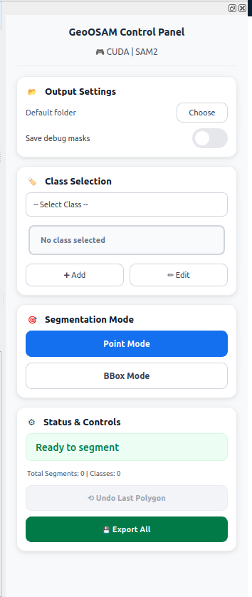
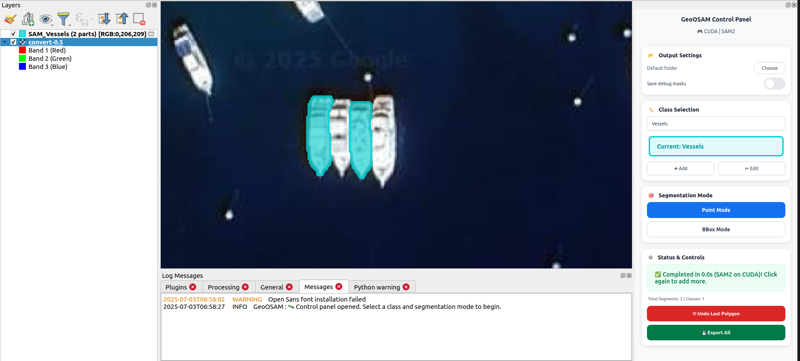
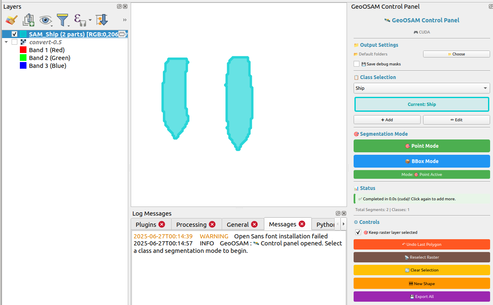

# GeoOSAM - Advanced Segmentation for QGIS

🛰️ **State-of-the-art image segmentation using Meta's SAM 2.1, SAM3 (NEW in v1.3), and Ultralytics models with intelligent hardware optimization**

[](https://plugins.qgis.org)
[](https://python.org)
[](LICENSE)

## 🌟 Features

- **🤖 SAM3 Integration**: Text prompts, similar object detection, auto-segment (NEW in v1.3!)
- **🔑 SAM3 Pro Licensing**: Free tier (extent) + Pro tier (entire raster) (NEW in v1.3!)
- **⚙️ Model Size Selection**: Choose from 4-5 sizes for both Meta & Ultralytics models (NEW in v1.3!)
- **🗺️ Tiled Processing**: Process entire rasters with auto-tiling for large imagery (NEW in v1.3!)
- **📥 Automatic Downloads**: All models download automatically with progress bars (NEW in v1.3!)
- **🔐 Hugging Face Integration**: SAM3 downloads via token authentication (NEW in v1.3!)
- **🚀 Exceptional CPU Performance**: Sub-second segmentation on high-core CPUs (24+ cores)
- **🧠 Intelligent Hardware Detection**: Automatically selects best models for GPU/CPU
- **🛰️ Multi-spectral Support**: Native 5+ band UAV/satellite imagery with NDVI calculation
- **🎯 Multiple Modes**: Point-click, bounding box, batch, auto-segment, text prompts, similar objects
- **📋 12 Pre-defined Classes**: Buildings, Roads, Vegetation, Water, Vehicle, Vessels, and more
- **🌿 Enhanced Vegetation Detection**: Spectral analysis for superior vegetation mapping
- **🌐 Online Map Support**: Works with ESRI, Google Satellite, and XYZ/WMS/WMTS tile services
- **↶ Undo Support**: Mistake correction with polygon-level undo
- **📁 Custom Output**: User-selectable output folders
- **🎨 Class Management**: Custom classes with color coding
- **📡 Smart Workflow**: Auto-raster selection, progress tracking
- **💾 Professional Export**: Shapefile export with detailed attributes
- **🔧 Adaptive Processing**: Optimized based on zoom level and hardware

## 📊 Performance & Model Selection

### Available Models (v1.3)

| Hardware Type     | Available Models                            | User Selection        |
| ----------------- | ------------------------------------------- | --------------------- |
| **GPU (>3GB)**    | SAM2.1 Tiny/Small/Base+/Large (Meta) + SAM3 | 5 models via dropdown |
| **Apple Silicon** | SAM2.1 Tiny/Small/Base+/Large (Meta) + SAM3 | 5 models via dropdown |
| **CPU / Low GPU** | SAM2.1_T/B/L (Ultralytics, CPU-optimized)   | 3 models via dropdown |

### Model Sizes & Performance

| Model              | Size   | Best For          | Speed (GPU) | Speed (CPU 24+) |
| ------------------ | ------ | ----------------- | ----------- | --------------- |
| **SAM2.1 Tiny**    | 156MB  | Fast processing   | 0.2-0.4s    | 1-2s            |
| **SAM2.1 Small**   | 184MB  | Balanced          | 0.3-0.6s    | 1.5-3s          |
| **SAM2.1 Base+**   | 323MB  | High accuracy     | 0.5-1s      | 3-5s            |
| **SAM2.1 Large**   | 898MB  | Best quality      | 0.8-1.5s    | 5-8s            |
| **SAM3**           | ~160MB | Auto-segment/Text | 0.3-0.7s    | N/A             |
| **SAM2.1_T (CPU)** | ~40MB  | Fast CPU          | N/A         | **<1s**         |
| **SAM2.1_B (CPU)** | ~80MB  | Balanced CPU      | N/A         | 1-2s            |
| **SAM2.1_L (CPU)** | ~224MB | Quality CPU       | N/A         | 2-3s            |

**🎯 Intelligent Selection:**

- **GPU Systems (>3GB)**: Dropdown offers 4 SAM2.1 sizes + SAM3 for flexibility
- **CPU Systems**: Dropdown offers 3 CPU-optimized SAM2.1 variants (T/B/L)
- **Automatic Detection**: Plugin detects your hardware on startup
- **One-Click Download**: Select any model, it downloads automatically with progress bar
- **Default Choice**: SAM3 for GPU (if available), SAM2.1_B for CPU

## 🚀 Quick Start

### 1. Install Plugin

Enable in QGIS Plugin Manager or download from GitHub

### 2. Load Imagery & Select Class

**Supported Data Sources:**

- 🗂️ Local raster files (GeoTIFF, JP2, etc.)
- 🌐 ESRI services
- 🗺️ Google Satellite, Bing Aerial (XYZ tiles)
- 🌍 WMS/WMTS tile services



### 3. Point & Click to Segment

Select a class (Buildings, Water, etc.) and click on objects in your imagery. Works identically with local rasters and online tile services.

### 4. View Results



### 5. Export Professional Shapefiles


_Export segmented polygons as shapefiles with detailed attributes_

## 🤖 SAM3 Features (v1.3)

**SAM3 integration with semantic segmentation - CLIP tokenizer fixed!**

### Auto-Segment 🎯 ✅ PRODUCTION READY

Automatically find ALL objects in an area without clicking:

- Segments everything visible automatically
- No prompts or clicking needed
- Great for dense object detection
- Uses SAM3's automatic instance segmentation
- **Tested:** ✅ Fully functional

**How to use:**

1. Select SAM3 from model dropdown (GPU required)
2. Select "Auto-Segment" mode button
3. Choose scope: "Visible Extent (AOI)" or "Entire Raster"
4. Click anywhere to trigger automatic segmentation

### Text Prompts 📝 ✅ WORKING

**Status: CLIP tokenizer bug FIXED in v1.3**

- **Fix:** Custom CLIP tokenizer monkey-patch applied at runtime
- **Functionality:** Enter text like "building", "car", "tree" to find matching objects
- **Accuracy:** High-quality semantic understanding via CLIP
- **Tested:** ✅ Fully functional with all text prompts

**How to use:**

1. Select SAM3 from model dropdown
2. Enter text prompt (e.g., "buildings", "vehicles")
3. Choose scope: "Visible Extent (AOI)" or "Entire Raster"\*
4. Click "Auto-Segment All Objects"

### Similar Objects 🔍 ✅ WORKING

**Status: Exemplar mode FIXED in v1.3**

- **Fix:** Same CLIP tokenizer fix enables exemplar-based search
- **Functionality:** Click one object to find all similar objects
- **Technology:** Uses SAM3 exemplar mode with CLIP embeddings
- **Tested:** ✅ Fully functional

**How to use:**

1. Select SAM3 from model dropdown
2. Click "Find Similar" mode button
3. Choose scope: "Visible Extent (AOI)" or "Entire Raster"\*
4. Click on a reference object to find all similar ones

**\*SAM3 Pro Licensing:**

GeoOSAM is **free and open-source**, but SAM3 Pro features help sustain development:

- **Free Tier (Forever):**

  - All SAM2/SAM2.1 features - unlimited
  - SAM3 text prompts and similar mode on **Visible Extent (AOI)** - unlimited
  - Perfect for most use cases!

- **Pro Tier (Supports Development):**

  - SAM3 text prompts and similar mode on **Entire Raster** with auto-tiling
  - Ideal for production workflows and large-scale mapping
  - Helps fund ongoing development, bug fixes, and new features

- **Get License:** Contact **geoosamplugin@gmail.com**
- **Activation:** Click "Manage License" button in plugin (offline validation)

**Test Results (2025-12-28 - v1.3):**

- ✅ SAM3 initialization: SUCCESS
- ✅ Auto-segmentation: SUCCESS
- ✅ Text prompts (CLIP): SUCCESS (tokenizer fixed)
- ✅ Exemplar mode (CLIP): SUCCESS (tokenizer fixed)
- ✅ Entire raster processing: SUCCESS (tiled processing with 1024px tiles)

**📥 SAM3 Download:**

- Downloads via Hugging Face with access token
- Token prompt appears in QGIS on first use
- Requires Read token from https://huggingface.co/settings/tokens

**⚠️ Requirements:**

- GPU with >3GB memory (CUDA or Apple Silicon)
- Ultralytics >= 8.3.237
- Hugging Face account with access token

## 🛠 Known Issues

For current limitations and upcoming fixes, see:

👉 [Known Issues](#known-issues-and-planned-fixes)

## ⚠️ Batch Mode Development Status

**Batch mode is currently in active development** with varying performance across different object classes:

### 🎯 **Tested Classes:**

- **Vegetation** ✅ - Advanced NDVI analysis, excellent results with multi-spectral imagery
- **Vessels** ✅ - Optimized for water body detection, good performance
- **Buildings/Residential** 🔧 - Basic functionality, mixed results

### 🔧 **Classes Under Development:**

- **Other classes** 🚧 - Limited testing, performance may vary

### 📝 **Best Practice:**

- **Point-click mode** remains the most reliable for all classes
- **Batch mode** works best on clear, high-contrast imagery
- **Mixed workflow** recommended: use batch where it works well, point-click for precision

## 📋 System Requirements

### Minimum

- QGIS 3.16+
- Python 3.7+
- 8GB RAM
- 2GB disk space

### Recommended

- QGIS 3.28+
- NVIDIA GPU with CUDA or Apple Silicon
- 16GB+ RAM
- SSD storage

## 📦 Installation

**⚠️ Important: Both installation methods require manual dependency installation**

### Option 1: From QGIS Plugin Repository (Recommended)

1. Open QGIS
2. Go to **Plugins > Manage and Install Plugins**
3. Search "GeoOSAM"
4. Click **Install Plugin**
5. **Install dependencies** (see below)

### Option 2: Download from GitHub (Manual)

1. Download ZIP from: https://github.com/espressouk/GeoOSAM
2. Extract the plugin:

   ```bash
   # Extract and rename to remove -main suffix
   unzip GeoOSAM-main.zip
   mv GeoOSAM-main geoOSAM
   cd geoOSAM
   ```

3. Copy to QGIS plugins directory:

   ```bash
   # Linux
   cp -r . ~/.local/share/QGIS/QGIS3/profiles/default/python/plugins/geo_osam

   # macOS
   cp -r . ~/Library/Application\ Support/QGIS/QGIS3/profiles/default/python/plugins/geo_osam

   # Windows
   xcopy . "C:\Users\%USERNAME%\AppData\Roaming\QGIS\QGIS3\profiles\default\python\plugins\geo_osam" /E /I
   ```

4. **Install dependencies** (see below)

### Required Dependencies (Both Options)

**🎯 Windows: Use OSGeo4W Shell (Recommended)**

**IMPORTANT: Choose CPU or CUDA version based on your hardware!**

```bash
# Open OSGeo4W Shell (Start Menu → OSGeo4W → OSGeo4W Shell)
# Check if you have NVIDIA GPU:
nvidia-smi

# If nvidia-smi shows your GPU, install CUDA version:
pip install torch torchvision --index-url https://download.pytorch.org/whl/cu118
pip install "ultralytics>=8.3.237" opencv-python rasterio shapely hydra-core iopath pillow numpy

# If no NVIDIA GPU or nvidia-smi fails, install CPU version:
# pip install torch torchvision "ultralytics>=8.3.237" opencv-python rasterio shapely hydra-core iopath pillow numpy
```

**Optional for SAM3 text/similar (PCS)**

SAM3 text and exemplar prompts are still under active development in Ultralytics and may be unstable. If you want to use them:

```bash
pip install git+https://github.com/ultralytics/CLIP.git ftfy wcwidth
```

**Hugging Face Access (SAM3 Weights)**

To download SAM3 weights from within QGIS, create a Hugging Face **Access Token** with **Token type: Read** and paste it into the download dialog.

**🍎 macOS: Use Terminal**

```bash
pip3 install torch torchvision "ultralytics>=8.3.237" opencv-python rasterio shapely hydra-core iopath pillow numpy
```

**🐧 Linux: Use Terminal**

```bash
# For NVIDIA GPU with CUDA:
pip3 install torch torchvision --index-url https://download.pytorch.org/whl/cu118
pip3 install "ultralytics>=8.3.237" opencv-python rasterio shapely hydra-core iopath pillow numpy

# For CPU-only:
# pip3 install torch torchvision "ultralytics>=8.3.237" opencv-python rasterio shapely hydra-core iopath pillow numpy
```

**🔧 Alternative: QGIS Python Console (All Platforms)**

```python
# Open QGIS > Plugins > Python Console, paste and run:
import subprocess
import sys
packages = ["torch", "torchvision", "ultralytics>=8.3.237", "opencv-python", "rasterio", "shapely", "hydra-core", "iopath", "pillow", "numpy"]
for pkg in packages: subprocess.check_call([sys.executable, "-m", "pip", "install", pkg]); print(f"✅ Installed {pkg}")
```

**⚠️ IMPORTANT: Verify CUDA for Windows/Linux GPU Users**

```python
# After installation, verify CUDA is working (QGIS Python Console):
import torch
print(f"CUDA available: {torch.cuda.is_available()}")
if torch.cuda.is_available():
    print(f"GPU: {torch.cuda.get_device_name(0)}")
```

**Expected:** `CUDA available: True` + your GPU name

**If False:** You installed CPU-only PyTorch by mistake! See [Installation Guide](docs/installation.md) for fix.

### Model Download (Automatic)

**✨ NEW in v1.3.0: All models download automatically with progress bars!**

**🔄 How It Works:**

1. **Select Model Size**: Choose from dropdown (4 GPU models or 3 CPU models)
2. **Automatic Download**: First-time use triggers download with progress bar
3. **One-Time Setup**: Models cached locally for instant future use
4. **No Manual Steps**: Everything happens automatically!

**📥 Download Details:**

| Model Type             | How It Downloads                         | Where Stored                       |
| ---------------------- | ---------------------------------------- | ---------------------------------- |
| **SAM2.1 (GPU)**       | Direct download with progress dialog     | Plugin checkpoints folder          |
| **SAM2.1 T/B/L (CPU)** | Ultralytics auto-download (notification) | `~/.ultralytics/weights/`          |
| **SAM3**               | Hugging Face with token prompt           | Plugin folder or Ultralytics cache |

**⚡ Performance Highlights:**

- **Multiple Size Options**: Choose speed vs accuracy tradeoff
- **24+ Core CPUs**: Sub-second segmentation with SAM2.1_T
- **Intelligent Threading**: Automatically uses 75% of available cores
- **Memory Optimized**: Efficient processing for large imagery
- **GPU Acceleration**: Full CUDA/Apple Silicon support

**🔧 Manual Download (if needed):**

```bash
# SAM2.1 models (GPU) are auto-downloaded on first use
# SAM2.1 T/B/L (CPU) are auto-downloaded by Ultralytics
# SAM3 requires Hugging Face token (prompted in UI)

# Manual fallback for SAM2.1 (rare):
cd ~/.local/share/QGIS/QGIS3/profiles/default/python/plugins/geo_osam/sam2/checkpoints/
wget https://dl.fbaipublicfiles.com/segment_anything_2/092824/sam2.1_hiera_tiny.pt
# Replace 'tiny' with 'small', 'base_plus', or 'large' as needed
```

## 🎯 Use Cases

- **🏙️ Urban Planning**: Building and infrastructure mapping
- **🌱 Environmental Monitoring**: Vegetation and land cover analysis with NDVI
- **🛰️ UAV/Drone Mapping**: Multi-spectral imagery analysis and processing
- **🚗 Transportation**: Vehicle and traffic analysis
- **🌊 Coastal Studies**: Ship detection and water body mapping
- **🏗️ Construction**: Site monitoring and progress tracking
- **📡 Remote Sensing**: Large-scale multi-spectral imagery analysis
- **🌾 Agriculture**: Crop monitoring with spectral vegetation indices

## 🛰️ Multi-spectral UAV/Satellite Support

### **Advanced Spectral Analysis**

GeoOSAM now provides native support for high-resolution multi-spectral imagery:

| Feature                | Capability                      | Benefit                       |
| ---------------------- | ------------------------------- | ----------------------------- |
| **5+ Band Support**    | Automatic NDVI calculation      | Superior vegetation detection |
| **Reflectance Values** | 0-1 range preservation          | Accurate spectral analysis    |
| **High Resolution**    | UAV imagery (0.08m/pixel)       | Fine-scale object detection   |
| **Batch Processing**   | Up to 100 objects per selection | Efficient large-area mapping  |
| **Shape Filtering**    | Road/track rejection            | Clean vegetation results      |

### **Supported Image Types**

- **Multi-spectral UAV**: 5+ band imagery (Blue, Green, Red, NIR, RedEdge)
- **Satellite Imagery**: Landsat, Sentinel, Planet, etc.
- **Reflectance Data**: Automatically handles 0-1 reflectance values
- **High-Resolution**: Optimized for 0.05-0.1m pixel size UAV imagery
- **Standard RGB**: Backward compatible with 3-band imagery

### **Intelligent Band Processing**

🔹 **5+ Bands**: Automatic NDVI calculation using NIR/Red bands  
🔹 **3-4 Bands**: Enhanced green channel processing  
🔹 **RGB**: Standard texture analysis  
🔹 **Single Band**: Grayscale texture detection

### **Vegetation Detection Excellence**

For vegetation mapping, GeoOSAM automatically:

- **Calculates NDVI** from NIR and Red bands
- **Filters linear features** (roads, tracks) with shape analysis
- **Processes up to 100 objects** in batch mode
- **Validates object geometry** (aspect ratio, solidity)
- **Preserves spectral fidelity** throughout processing

## ⚙️ Technical Details

### Model Architecture

- **SAM 2.1 (Meta)**: Latest from Meta AI with 4 size variants (Tiny/Small/Base+/Large)
  - Sept 2024 release with improved accuracy for small objects
  - Optimized for GPU inference (CUDA/Apple Silicon)
  - Sizes: 156MB - 898MB with speed/accuracy tradeoffs
- **SAM2.1 T/B/L (Ultralytics)**: CPU-optimized variants
  - T=Tiny (40MB), B=Base (80MB), L=Large (224MB)
  - Enhanced multi-core CPU performance
  - Efficient threading for sub-second segmentation
- **SAM3 (Ultralytics)**: Advanced instance segmentation
  - ✅ Auto-segmentation - WORKING (tested 2025-12-26, 5 objects detected)
  - ❌ Text prompts - NOT WORKING (CLIP tokenizer bug in v8.3.240)
  - ❌ Similar objects mode - NOT WORKING (same CLIP tokenizer issue)
  - Requires Ultralytics >= 8.3.237 and GPU >3GB
  - Issue: https://github.com/ultralytics/ultralytics/issues/22647
- **Automatic Selection**: Based on hardware detection and user preference

### Performance Optimization

- **Intelligent Threading**: High-core CPUs (16+) use 75% of cores for optimal performance
- **Model Size Selection**: User can choose speed vs accuracy tradeoff per task
- **Adaptive Crop Sizes**: Zoom-level aware processing
- **Memory Management**: Efficient handling of large imagery
- **Device Detection**: Automatic CUDA/MPS/CPU optimization with core-count awareness
- **Tiled Processing**: 1024x1024 tiles with 128px overlap for large rasters
- **Threaded Workers**: Non-blocking UI during intensive operations

## 📚 Documentation

- [User Guide](docs/user_guide.md)
- [Installation Guide](docs/installation.md)
- [Troubleshooting](docs/troubleshooting.md)
- [API Reference](docs/api.md)

## 🤝 Contributing

We welcome contributions! Please see our [Contributing Guide](CONTRIBUTING.md).

## 📞 Support

- **Issues**: [GitHub Issues](https://github.com/espressouk/GeoOSAM/issues)
- **Email**: bkst.dev@gmail.com
- **Documentation**: [Wiki](https://github.com/espressouk/GeoOSAM/wiki)

## 🙏 Acknowledgments

- **Meta AI**: For the Segment Anything Model (SAM 2.1)
- **Ultralytics**: For SAM2.1_B integration and optimization
- **QGIS Community**: For the excellent GIS platform
- **PyTorch Team**: For the deep learning framework

---

## ☕ Support GeoOSAM

If you find this plugin useful, please consider [buying me a coffee](https://buymeacoffee.com/OpticBloom) to support continued development and new features.
[](https://buymeacoffee.com/OpticBloom)

## 📄 License

This project is licensed under the GPL v2 License - see the [LICENSE](LICENSE) file for details.

## 🏆 Citation

If you use GeoOSAM in your research, please cite:

```bibtex
@software{geosam2025,
  title={GeoOSAM: Advanced Segmentation for QGIS with Intelligent Model Selection},
  author={Butbega, Ofer},
  year={2025},
  url={https://github.com/espressouk/GeoOSAM}
}
```

## 🔄 Changelog

### v1.3.0 - SAM3 & Model Management Updates (2025-12-22)

**🎯 Major Features:**

- **🤖 SAM3 Support**: Automatic instance segmentation (tested 2025-12-26)
  - Auto-segment: ✅ PRODUCTION READY - Automatically find all objects (5 objects detected in test)
  - Text prompts: ❌ NOT WORKING - CLIP tokenizer bug in v8.3.240 (uses auto-segment fallback)
  - Similar objects: ❌ NOT WORKING - Same CLIP tokenizer issue (uses auto-segment approximation)
  - Issue tracking: https://github.com/ultralytics/ultralytics/issues/22647
- **⚙️ Model Size Selection**: Choose optimal model for your needs
  - GPU: 4 SAM2.1 sizes (Tiny/Small/Base+/Large, 156MB-898MB) + SAM3
  - CPU: 3 SAM2.1 sizes (T/B/L, 40MB-224MB, Ultralytics optimized)
  - User-friendly dropdown with size and performance info
- **🗺️ Scope Selector**: Process visible area (AOI) or entire raster
  - AOI mode: Fast processing of visible extent
  - Full raster mode: Auto-tiling with 1024px tiles, 128px overlap
  - Progress tracking for tiled operations
  - **🛑 Cancel button**: Abort long-running tiled operations at any time
- **📥 Automatic Downloads**: All models download on-demand
  - SAM2.1 (GPU): Progress bar with percentage complete
  - SAM2.1 T/B/L (CPU): Ultralytics auto-download with notification
  - SAM3: Hugging Face token prompt for secure download
  - Manual download URLs provided if auto-download fails

**🔧 Improvements:**

- **✨ ENHANCED**: Automatic hardware detection and model availability checks
- **✨ ENHANCED**: UI dynamically shows/hides SAM3 features based on availability
- **✅ FIXED**: Similar mode bbox handling and mask result processing
- **✅ FIXED**: Threaded tiled processing for responsive UI during large raster operations
- **🚀 OPTIMIZED**: All SAM2.1 model URLs verified and updated to September 2024 release

### v1.2.2 - Threading Configuration Fix (2025-09-20)

- **🔧 FIXED**: PyTorch threading initialization error when other plugins pre-configure threads
- **🔧 FIXED**: "cannot set number of interop threads" RuntimeError on plugin startup
- **⚡ ENHANCED**: Thread configuration with graceful fallback for pre-initialized environments
- **🤝 IMPROVED**: Compatibility with other PyTorch-based QGIS plugins

### v1.2.1 - Online Tile Layer Support (2025-07-20)

- **🌐 NEW**: Support for online tile services (XYZ, WMS, WMTS)
- **🗺️ NEW**: Works with ESRI, Google Satellite, Bing Aerial
- **⚡ NEW**: Automatic tile caching with proper georeferencing

### v1.2.0 - Multi-spectral UAV Support (2025-07-09)

- **🛰️ NEW**: Native multi-spectral UAV/satellite imagery support (5+ bands)
- **🌿 NEW**: Automatic NDVI calculation for vegetation detection using NIR/Red bands
- **🔧 FIXED**: High-resolution reflectance value preservation (0-1 range)
- **🔧 FIXED**: Data type truncation issues with multi-spectral imagery
- **🚀 NEW**: Enhanced batch processing with up to 100 objects for vegetation
- **🎯 NEW**: Intelligent shape filtering to reject roads/tracks in vegetation detection
- **🔧 FIXED**: SAM2 tensor mismatch errors with multi-spectral input
- **🔧 FIXED**: Oversized mask validation (rejects masks >10% of image area)
- **🔧 FIXED**: Mathematical warnings in texture calculation
- **🌿 ENHANCED**: Vegetation detection with aspect ratio and solidity filtering
- **📊 NEW**: Comprehensive logging for debugging high-resolution imagery issues
- **🛰️ NEW**: Dual processing path - RGB for SAM2, full spectral for vegetation analysis

### v1.1.0 - Latest (2025-07-03)

- **FIXED**: Multiple raster layer support - segmentation now works with selected raster (same CRS)
- **FIXED**: Panel focus management - controls properly lose focus after use
- **FIXED**: Added close/minimize button to control panel header
- **FIXED**: Font display issues on Hi-DPI screens
- **FIXED**: Enabled bounding box selection mode for rectangular area prompts
- **NEW**: Refined GUI with improved user interface design
- **NEW**: Flexible panel width for better screen adaptation
- Enhanced panel layout and control positioning
- Improved keyboard event filtering and focus handling
- Better multi-raster workflow support
- General stability and usability improvements

### v1.0.0 - Major Update with Intelligent Model Selection

- **Intelligent Model Selection**: Automatic SAM 2.1 vs SAM2.1_B selection
- **Enhanced CPU Performance**: SAM2.1_B integration for 5-10x CPU speedup
- **Ultralytics Integration**: Professional computer vision library support
- **Improved Device Detection**: Better GPU/CPU/Apple Silicon handling
- **Updated Dependencies**: Modern ML stack with automatic model downloads

### ⚙️ Environment Options

To force **CPU-only mode**, set this environment variable **before launching QGIS**:

```bash
export GEOOSAM_FORCE_CPU=1
```

### 📋 Reporting Issues

Please check:

- Plugin version (latest preferred)
- QGIS version (3.16+ required)
- Dependencies installed:

  - `torch`
  - `torchvision`
  - `ultralytics`
  - `opencv-python`
  - `rasterio`
  - `shapely`
  - `hydra-core`
  - `iopath`

Report issues at: [GitHub Issues](https://github.com/espressouk/GeoOSAM/issues)

### 🚀 Planned Features

To be determined based on user feedback and usage patterns.

### 💡 Performance Tips

- **Zoom wisely**: Try different zoom levels to get the best results for your selected class.
- **Force CPU mode**: If GPU memory is limited
  <!-- - **Use 🧹 Clear Memory**: To release RAM/GPU memory during long sessions -->
  <!-- - **Close heavy apps**: To free resources for segmentation -->

---

**Last updated:** 2025-12-22
**Plugin Version:** 1.3.0
**QGIS Compatibility:** 3.16+
