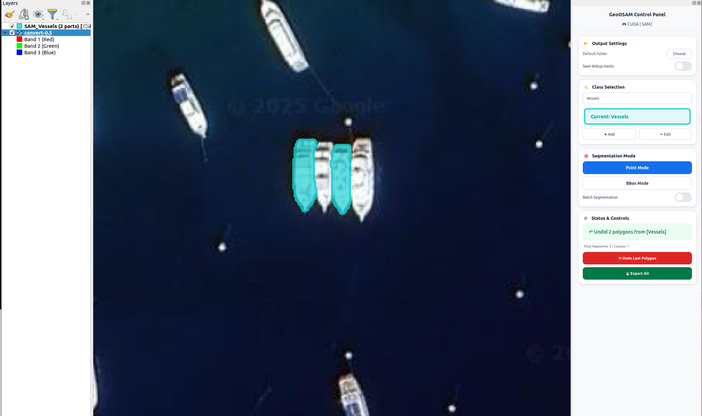
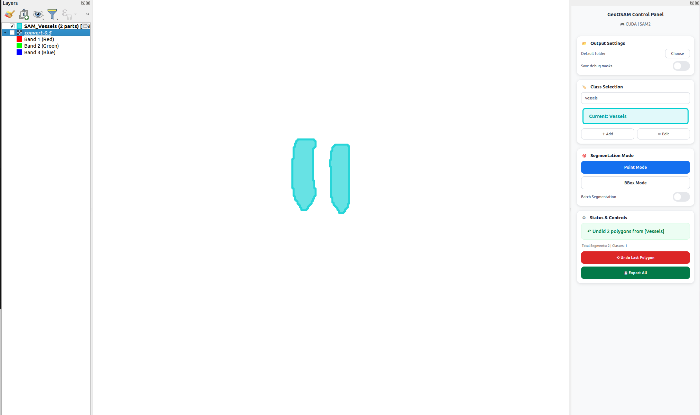

# GeoOSAM - Advanced Segmentation for QGIS

🛰️ **State-of-the-art image segmentation using Meta's SAM 2.1 and MobileSAM with intelligent hardware optimization**

[](https://plugins.qgis.org)
[](https://python.org)
[](LICENSE)

## 🌟 Features

- **🚀 Exceptional CPU Performance**: Sub-second segmentation on high-core CPUs (24+ cores)
- **🧠 Intelligent Model Selection**: Automatically chooses the best AI model for your hardware
- **🚀 Optimized Performance**: SAM 2.1 for GPU, MobileSAM for CPU
- **🎯 Dual Modes**: Point-click and bounding box segmentation
- **📋 12 Pre-defined Classes**: Buildings, Roads, Vegetation, Water, Vehicle, Ship, and more
- **↶ Undo Support**: Mistake correction with polygon-level undo
- **📁 Custom Output**: User-selectable output folders
- **🎨 Class Management**: Custom classes with color coding
- **📡 Smart Workflow**: Auto-raster selection, progress tracking
- **💾 Professional Export**: Shapefile export with detailed attributes
- **🔧 Adaptive Processing**: Optimized based on zoom level and hardware

## 📊 Performance & Model Selection

| Hardware       | Model Used | Download Size | Typical Speed | Improvement       |
| -------------- | ---------- | ------------- | ------------- | ----------------- |
| NVIDIA RTX GPU | SAM 2.1    | ~160MB        | 0.2-0.5s      | **10-50x faster** |
| Apple M1/M2    | SAM 2.1    | ~160MB        | 1-2s          | **5-15x faster**  |
| 24+ Core CPU   | MobileSAM  | ~40MB         | **<1s**       | **20-30x faster** |
| 8-16 Core CPU  | MobileSAM  | ~40MB         | 1-2s          | **10-15x faster** |
| 4-8 Core CPU   | MobileSAM  | ~40MB         | 2-4s          | **5-10x faster**  |

**🎯 Smart Model Selection:**

- **GPU Available** (CUDA/Apple Silicon) → **SAM 2.1** (latest accuracy)
- **High-Core CPU** (16+ cores) → **MobileSAM** (optimized threading, <1s performance)
- **Standard CPU** → **MobileSAM** (efficient multi-threading)
- **Automatic Fallback** → SAM 2 if other models unavailable

## 🚀 Quick Start

### 1. Install Plugin

Enable in QGIS Plugin Manager or download from GitHub

### 2. Load Imagery & Select Class


### 3. Point & Click to Segment

Select a class (Buildings, Water, etc.) and click on objects in your imagery

### 4. View Results



### 5. Export Professional Shapefiles


_Export segmented polygons as shapefiles with detailed attributes_

## 🛠 Known Issues

For current limitations and upcoming fixes, see:

👉 [Known Issues](#known-issues-and-planned-fixes)

## 📋 System Requirements

### Minimum

- QGIS 3.16+
- Python 3.7+
- 8GB RAM
- 2GB disk space

### Recommended

- QGIS 3.28+
- NVIDIA GPU with CUDA or Apple Silicon
- 16GB+ RAM
- SSD storage

## 📦 Installation

**⚠️ Important: Both installation methods require manual dependency installation**

### Option 1: From QGIS Plugin Repository (Recommended)

1. Open QGIS
2. Go to **Plugins > Manage and Install Plugins**
3. Search "GeoOSAM"
4. Click **Install Plugin**
5. **Install dependencies** (see below)

### Option 2: Download from GitHub (Manual)

1. Download ZIP from: https://github.com/espressouk/GeoOSAM
2. Extract the plugin:

   ```bash
   # Extract and rename to remove -main suffix
   unzip GeoOSAM-main.zip
   mv GeoOSAM-main geoOSAM
   cd geoOSAM
   ```

3. Copy to QGIS plugins directory:

   ```bash
   # Linux
   cp -r . ~/.local/share/QGIS/QGIS3/profiles/default/python/plugins/geo_osam

   # macOS
   cp -r . ~/Library/Application\ Support/QGIS/QGIS3/profiles/default/python/plugins/geo_osam

   # Windows
   xcopy . "C:\Users\%USERNAME%\AppData\Roaming\QGIS\QGIS3\profiles\default\python\plugins\geo_osam" /E /I
   ```

4. **Install dependencies** (see below)

### Required Dependencies (Both Options)

**🎯 Windows: Use OSGeo4W Shell (Recommended)**

```bash
# Open OSGeo4W Shell (Start Menu → OSGeo4W → OSGeo4W Shell)
# This ensures you're using the same Python environment as QGIS
pip install torch torchvision ultralytics opencv-python rasterio shapely hydra-core iopath
```

**🍎 macOS/🐧 Linux: Use Terminal**

```bash
pip3 install torch torchvision ultralytics opencv-python rasterio shapely hydra-core iopath
```

**🔧 Alternative: QGIS Python Console (All Platforms)**

```python
# Open QGIS > Plugins > Python Console, paste and run:
import subprocess
import sys
packages = ["torch", "torchvision", "ultralytics", "opencv-python", "rasterio", "shapely", "hydra-core", "iopath"]
for pkg in packages: subprocess.check_call([sys.executable, "-m", "pip", "install", pkg]); print(f"✅ Installed {pkg}")
```

### Model Download (Automatic)

**Models are automatically downloaded when you first use the plugin - no manual intervention needed!**

**🔄 Download Process:**

- **CPU Systems**: Ultralytics automatically downloads MobileSAM (~40MB) on first use
- **GPU Systems**: Plugin auto-downloads SAM 2.1 checkpoint (~160MB) on first use
- **Total Size**: ~40MB (CPU only) or ~160MB (GPU systems)

**📥 What happens automatically:**

1. **Device Detection**: Plugin detects your hardware (GPU/CPU)
2. **Smart Download**: Downloads only the model needed for your system
3. **Background Process**: Models download automatically during first segmentation
4. **One-time Setup**: Subsequent runs use cached models

**⚡ Performance Highlights:**

- **24+ Core CPUs**: Sub-second segmentation rivals GPU performance
- **Intelligent Threading**: Automatically uses 75% of available cores on high-end systems
- **MobileSAM Scaling**: Exceptional multi-core efficiency compared to traditional models
- **Memory Optimized**: Efficient processing even on large imagery datasets

**🔧 Manual Download (if auto-download fails):**

```bash
# For SAM 2.1 (GPU users only)
cd ~/.local/share/QGIS/QGIS3/profiles/default/python/plugins/geo_osam/sam2/checkpoints/
bash download_sam2_checkpoints.sh

# For MobileSAM (CPU users) - handled automatically by Ultralytics
# No manual download needed - Ultralytics manages this automatically
```

## 🎯 Use Cases

- **🏙️ Urban Planning**: Building and infrastructure mapping
- **🌱 Environmental Monitoring**: Vegetation and land cover analysis
- **🚗 Transportation**: Vehicle and traffic analysis
- **🌊 Coastal Studies**: Ship detection and water body mapping
- **🏗️ Construction**: Site monitoring and progress tracking
- **📡 Remote Sensing**: Large-scale imagery analysis

## ⚙️ Technical Details

### Model Architecture

- **SAM 2.1**: Latest from Meta AI with improved accuracy for small objects
- **MobileSAM**: Lightweight version with Tiny-ViT encoder (5M vs 632M parameters)
- **Automatic Selection**: Based on available GPU memory and compute capability

### Performance Optimization

- **Intelligent Threading**: High-core CPUs (16+) use 75% of cores for optimal performance
- **MobileSAM Efficiency**: 5x smaller model with exceptional multi-core scaling
- **Adaptive Crop Sizes**: Zoom-level aware processing
- **Memory Management**: Efficient handling of large imagery
- **Device Detection**: Automatic CUDA/MPS/CPU optimization with core-count awareness

## 📚 Documentation

- [User Guide](docs/user_guide.md)
- [Installation Guide](docs/installation.md)
- [Troubleshooting](docs/troubleshooting.md)
- [API Reference](docs/api.md)

## 🤝 Contributing

We welcome contributions! Please see our [Contributing Guide](CONTRIBUTING.md).

## 📞 Support

- **Issues**: [GitHub Issues](https://github.com/espressouk/GeoOSAM/issues)
- **Email**: bkst.dev@gmail.com
- **Documentation**: [Wiki](https://github.com/espressouk/GeoOSAM/wiki)

## 🙏 Acknowledgments

- **Meta AI**: For the Segment Anything Model (SAM 2.1)
- **Ultralytics**: For MobileSAM integration and optimization
- **QGIS Community**: For the excellent GIS platform
- **PyTorch Team**: For the deep learning framework

## 📄 License

This project is licensed under the GPL v2 License - see the [LICENSE](LICENSE) file for details.

## 🏆 Citation

If you use GeoOSAM in your research, please cite:

```bibtex
@software{geosam2025,
  title={GeoOSAM: Advanced Segmentation for QGIS with Intelligent Model Selection},
  author={Butbega, Ofer},
  year={2025},
  url={https://github.com/espressouk/GeoOSAM}
}
```

## 🔄 Changelog

### v1.1.0 - Latest (2025-07-03)

- **FIXED**: Multiple raster layer support - segmentation now works with selected raster (same CRS)
- **FIXED**: Panel focus management - controls properly lose focus after use
- **FIXED**: Added close/minimize button to control panel header
- **FIXED**: Font display issues on Hi-DPI screens
- **FIXED**: Enabled bounding box selection mode for rectangular area prompts
- **NEW**: Refined GUI with improved user interface design
- **NEW**: Flexible panel width for better screen adaptation
- Enhanced panel layout and control positioning
- Improved keyboard event filtering and focus handling
- Better multi-raster workflow support
- General stability and usability improvements

### v1.0.0 - Major Update with Intelligent Model Selection

- **Intelligent Model Selection**: Automatic SAM 2.1 vs MobileSAM selection
- **Enhanced CPU Performance**: MobileSAM integration for 5-10x CPU speedup
- **Ultralytics Integration**: Professional computer vision library support
- **Improved Device Detection**: Better GPU/CPU/Apple Silicon handling
- **Updated Dependencies**: Modern ML stack with automatic model downloads

### ⚙️ Environment Options

To force **CPU-only mode**, set this environment variable **before launching QGIS**:

```bash
export GEOOSAM_FORCE_CPU=1
```

### 📋 Reporting Issues

Please check:

- Plugin version (latest preferred)
- QGIS version (3.16+ required)
- Dependencies installed:

  - `torch`
  - `torchvision`
  - `ultralytics`
  - `opencv-python`
  - `rasterio`
  - `shapely`
  - `hydra-core`
  - `iopath`

Report issues at: [GitHub Issues](https://github.com/espressouk/GeoOSAM/issues)

### 🚀 Planned Features

To be determined based on user feedback and usage patterns.

### 💡 Performance Tips

- **Zoom wisely**: Try different zoom levels to get the best results for your selected class.
- **Force CPU mode**: If GPU memory is limited
  <!-- - **Use 🧹 Clear Memory**: To release RAM/GPU memory during long sessions -->
  <!-- - **Close heavy apps**: To free resources for segmentation -->

---

**Last updated:** 2025-07-03
**Plugin Version:** 1.1.0
**QGIS Compatibility:** 3.16+
