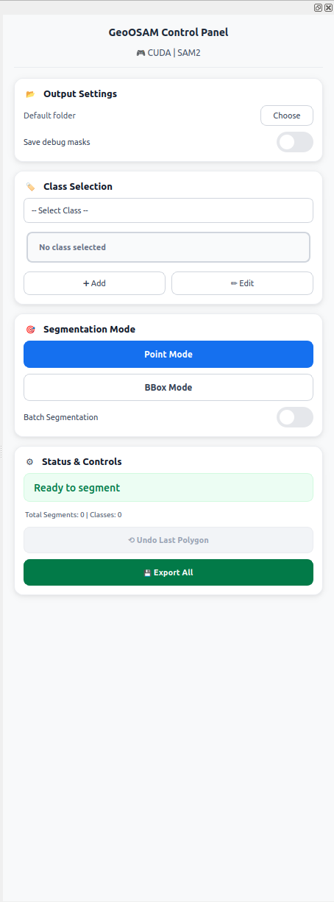

# GeoOSAM - Advanced Segmentation for QGIS

🛰️ **State-of-the-art image segmentation using Meta's SAM 2.1 and Ultralytics SAM2.1_B with intelligent hardware optimization**

[](https://plugins.qgis.org)
[](https://python.org)
[](LICENSE)

## 🌟 Features

- **🚀 Exceptional CPU Performance**: Sub-second segmentation on high-core CPUs (24+ cores)
- **🧠 Intelligent Model Selection**: Automatically chooses the best AI model for your hardware
- **🚀 Optimized Performance**: SAM 2.1 for GPU, Ultralytics SAM2.1_B for CPU
- **🛰️ Multi-spectral Support**: Native 5+ band UAV/satellite imagery with NDVI calculation
- **🎯 Three Modes**: Point-click, bounding box, and bbox batch processing
- **📋 12 Pre-defined Classes**: Buildings, Roads, Vegetation, Water, Vehicle, Vessels, and more
- **⚠️ Batch Mode Status**: Currently in development - some classes perform better than others
- **🌿 Enhanced Vegetation Detection**: Spectral analysis for superior vegetation mapping
- **🌐 Online Map Support**: Works with ESRI, Google Satellite, and XYZ/WMS/WMTS tile services
- **↶ Undo Support**: Mistake correction with polygon-level undo
- **📁 Custom Output**: User-selectable output folders
- **🎨 Class Management**: Custom classes with color coding
- **📡 Smart Workflow**: Auto-raster selection, progress tracking
- **💾 Professional Export**: Shapefile export with detailed attributes
- **🔧 Adaptive Processing**: Optimized based on zoom level and hardware

## 📊 Performance & Model Selection

| Hardware       | Model Used | Download Size | Typical Speed | Improvement       |
| -------------- | ---------- | ------------- | ------------- | ----------------- |
| NVIDIA RTX GPU | SAM 2.1    | ~160MB        | 0.2-0.5s      | **10-50x faster** |
| Apple M1/M2    | SAM 2.1    | ~160MB        | 1-2s          | **5-15x faster**  |
| 24+ Core CPU   | SAM2.1_B   | ~162MB        | **<1s**       | **20-30x faster** |
| 8-16 Core CPU  | SAM2.1_B   | ~162MB        | 1-2s          | **10-15x faster** |
| 4-8 Core CPU   | SAM2.1_B   | ~162MB        | 2-4s          | **5-10x faster**  |

**🎯 Smart Model Selection:**

- **GPU Available** (CUDA/Apple Silicon) → **SAM 2.1** (latest accuracy)
- **High-Core CPU** (16+ cores) → **SAM2.1_B** (Ultralytics, optimized threading, <1s performance)
- **Standard CPU** → **SAM2.1_B** (Ultralytics, efficient multi-threading)
- **Automatic Fallback** → SAM 2.1 if Ultralytics unavailable

## 🚀 Quick Start

### 1. Install Plugin

Enable in QGIS Plugin Manager or download from GitHub

### 2. Load Imagery & Select Class

**Supported Data Sources:**
- 🗂️ Local raster files (GeoTIFF, JP2, etc.)
- 🌐 ESRI services
- 🗺️ Google Satellite, Bing Aerial (XYZ tiles)
- 🌍 WMS/WMTS tile services



### 3. Point & Click to Segment

Select a class (Buildings, Water, etc.) and click on objects in your imagery. Works identically with local rasters and online tile services.

### 4. View Results


### 5. Export Professional Shapefiles


_Export segmented polygons as shapefiles with detailed attributes_

## 🛠 Known Issues

For current limitations and upcoming fixes, see:

👉 [Known Issues](#known-issues-and-planned-fixes)

## ⚠️ Batch Mode Development Status

**Batch mode is currently in active development** with varying performance across different object classes:

### 🎯 **Tested Classes:**

- **Vegetation** ✅ - Advanced NDVI analysis, excellent results with multi-spectral imagery
- **Vessels** ✅ - Optimized for water body detection, good performance
- **Buildings/Residential** 🔧 - Basic functionality, mixed results

### 🔧 **Classes Under Development:**

- **Other classes** 🚧 - Limited testing, performance may vary

### 📝 **Best Practice:**

- **Point-click mode** remains the most reliable for all classes
- **Batch mode** works best on clear, high-contrast imagery
- **Mixed workflow** recommended: use batch where it works well, point-click for precision

## 📋 System Requirements

### Minimum

- QGIS 3.16+
- Python 3.7+
- 8GB RAM
- 2GB disk space

### Recommended

- QGIS 3.28+
- NVIDIA GPU with CUDA or Apple Silicon
- 16GB+ RAM
- SSD storage

## 📦 Installation

**⚠️ Important: Both installation methods require manual dependency installation**

### Option 1: From QGIS Plugin Repository (Recommended)

1. Open QGIS
2. Go to **Plugins > Manage and Install Plugins**
3. Search "GeoOSAM"
4. Click **Install Plugin**
5. **Install dependencies** (see below)

### Option 2: Download from GitHub (Manual)

1. Download ZIP from: https://github.com/espressouk/GeoOSAM
2. Extract the plugin:

   ```bash
   # Extract and rename to remove -main suffix
   unzip GeoOSAM-main.zip
   mv GeoOSAM-main geoOSAM
   cd geoOSAM
   ```

3. Copy to QGIS plugins directory:

   ```bash
   # Linux
   cp -r . ~/.local/share/QGIS/QGIS3/profiles/default/python/plugins/geo_osam

   # macOS
   cp -r . ~/Library/Application\ Support/QGIS/QGIS3/profiles/default/python/plugins/geo_osam

   # Windows
   xcopy . "C:\Users\%USERNAME%\AppData\Roaming\QGIS\QGIS3\profiles\default\python\plugins\geo_osam" /E /I
   ```

4. **Install dependencies** (see below)

### Required Dependencies (Both Options)

**🎯 Windows: Use OSGeo4W Shell (Recommended)**

**IMPORTANT: Choose CPU or CUDA version based on your hardware!**

```bash
# Open OSGeo4W Shell (Start Menu → OSGeo4W → OSGeo4W Shell)
# Check if you have NVIDIA GPU:
nvidia-smi

# If nvidia-smi shows your GPU, install CUDA version:
pip install torch torchvision --index-url https://download.pytorch.org/whl/cu118
pip install "ultralytics>=8.3.237" opencv-python rasterio shapely hydra-core iopath pillow numpy

# If no NVIDIA GPU or nvidia-smi fails, install CPU version:
# pip install torch torchvision "ultralytics>=8.3.237" opencv-python rasterio shapely hydra-core iopath pillow numpy
```

**Optional for SAM3 text/similar (PCS)**

SAM3 text and exemplar prompts are still under active development in Ultralytics and may be unstable. If you want to use them:

```bash
pip install git+https://github.com/ultralytics/CLIP.git ftfy wcwidth
```

**Hugging Face Access (SAM3 Weights)**

To download SAM3 weights from within QGIS, create a Hugging Face **Access Token** with **Token type: Read** and paste it into the download dialog.

**🍎 macOS: Use Terminal**

```bash
pip3 install torch torchvision "ultralytics>=8.3.237" opencv-python rasterio shapely hydra-core iopath pillow numpy
```

**🐧 Linux: Use Terminal**

```bash
# For NVIDIA GPU with CUDA:
pip3 install torch torchvision --index-url https://download.pytorch.org/whl/cu118
pip3 install "ultralytics>=8.3.237" opencv-python rasterio shapely hydra-core iopath pillow numpy

# For CPU-only:
# pip3 install torch torchvision "ultralytics>=8.3.237" opencv-python rasterio shapely hydra-core iopath pillow numpy
```

**🔧 Alternative: QGIS Python Console (All Platforms)**

```python
# Open QGIS > Plugins > Python Console, paste and run:
import subprocess
import sys
packages = ["torch", "torchvision", "ultralytics>=8.3.237", "opencv-python", "rasterio", "shapely", "hydra-core", "iopath", "pillow", "numpy"]
for pkg in packages: subprocess.check_call([sys.executable, "-m", "pip", "install", pkg]); print(f"✅ Installed {pkg}")
```

**⚠️ IMPORTANT: Verify CUDA for Windows/Linux GPU Users**

```python
# After installation, verify CUDA is working (QGIS Python Console):
import torch
print(f"CUDA available: {torch.cuda.is_available()}")
if torch.cuda.is_available():
    print(f"GPU: {torch.cuda.get_device_name(0)}")
```

**Expected:** `CUDA available: True` + your GPU name

**If False:** You installed CPU-only PyTorch by mistake! See [Installation Guide](docs/installation.md) for fix.

### Model Download (Automatic)

**Models are automatically downloaded when you first use the plugin - no manual intervention needed!**

**🔄 Download Process:**

- **CPU Systems**: Ultralytics automatically downloads SAM2.1_B (~162MB) on first use
- **GPU Systems**: Plugin auto-downloads SAM 2.1 checkpoint (~160MB) on first use
- **Total Size**: ~160-162MB depending on model (SAM 2.1: ~160MB, SAM2.1_B: ~162MB)

**📥 What happens automatically:**

1. **Device Detection**: Plugin detects your hardware (GPU/CPU)
2. **Smart Download**: Downloads only the model needed for your system
3. **Background Process**: Models download automatically during first segmentation
4. **One-time Setup**: Subsequent runs use cached models

**⚡ Performance Highlights:**

- **24+ Core CPUs**: Sub-second segmentation rivals GPU performance
- **Intelligent Threading**: Automatically uses 75% of available cores on high-end systems
- **SAM2.1_B Scaling**: Exceptional multi-core efficiency via Ultralytics optimization
- **Memory Optimized**: Efficient processing even on large imagery datasets

**🔧 Manual Download (if auto-download fails):**

```bash
# For SAM 2.1 (GPU users only)
cd ~/.local/share/QGIS/QGIS3/profiles/default/python/plugins/geo_osam/sam2/checkpoints/
bash download_sam2_checkpoints.sh

# For SAM2.1_B (CPU users) - handled automatically by Ultralytics
# No manual download needed - Ultralytics manages this automatically
```

## 🎯 Use Cases

- **🏙️ Urban Planning**: Building and infrastructure mapping
- **🌱 Environmental Monitoring**: Vegetation and land cover analysis with NDVI
- **🛰️ UAV/Drone Mapping**: Multi-spectral imagery analysis and processing
- **🚗 Transportation**: Vehicle and traffic analysis
- **🌊 Coastal Studies**: Ship detection and water body mapping
- **🏗️ Construction**: Site monitoring and progress tracking
- **📡 Remote Sensing**: Large-scale multi-spectral imagery analysis
- **🌾 Agriculture**: Crop monitoring with spectral vegetation indices

## 🛰️ Multi-spectral UAV/Satellite Support

### **Advanced Spectral Analysis**

GeoOSAM now provides native support for high-resolution multi-spectral imagery:

| Feature                | Capability                      | Benefit                       |
| ---------------------- | ------------------------------- | ----------------------------- |
| **5+ Band Support**    | Automatic NDVI calculation      | Superior vegetation detection |
| **Reflectance Values** | 0-1 range preservation          | Accurate spectral analysis    |
| **High Resolution**    | UAV imagery (0.08m/pixel)       | Fine-scale object detection   |
| **Batch Processing**   | Up to 100 objects per selection | Efficient large-area mapping  |
| **Shape Filtering**    | Road/track rejection            | Clean vegetation results      |

### **Supported Image Types**

- **Multi-spectral UAV**: 5+ band imagery (Blue, Green, Red, NIR, RedEdge)
- **Satellite Imagery**: Landsat, Sentinel, Planet, etc.
- **Reflectance Data**: Automatically handles 0-1 reflectance values
- **High-Resolution**: Optimized for 0.05-0.1m pixel size UAV imagery
- **Standard RGB**: Backward compatible with 3-band imagery

### **Intelligent Band Processing**

🔹 **5+ Bands**: Automatic NDVI calculation using NIR/Red bands  
🔹 **3-4 Bands**: Enhanced green channel processing  
🔹 **RGB**: Standard texture analysis  
🔹 **Single Band**: Grayscale texture detection

### **Vegetation Detection Excellence**

For vegetation mapping, GeoOSAM automatically:

- **Calculates NDVI** from NIR and Red bands
- **Filters linear features** (roads, tracks) with shape analysis
- **Processes up to 100 objects** in batch mode
- **Validates object geometry** (aspect ratio, solidity)
- **Preserves spectral fidelity** throughout processing

## ⚙️ Technical Details

### Model Architecture

- **SAM 2.1**: Latest from Meta AI with improved accuracy for small objects
- **SAM2.1_B**: Ultralytics optimized version with enhanced CPU performance
- **Automatic Selection**: Based on available GPU memory and compute capability

### Performance Optimization

- **Intelligent Threading**: High-core CPUs (16+) use 75% of cores for optimal performance
- **SAM2.1_B Efficiency**: Ultralytics optimization with exceptional multi-core scaling
- **Adaptive Crop Sizes**: Zoom-level aware processing
- **Memory Management**: Efficient handling of large imagery
- **Device Detection**: Automatic CUDA/MPS/CPU optimization with core-count awareness

## 📚 Documentation

- [User Guide](docs/user_guide.md)
- [Installation Guide](docs/installation.md)
- [Troubleshooting](docs/troubleshooting.md)
- [API Reference](docs/api.md)

## 🤝 Contributing

We welcome contributions! Please see our [Contributing Guide](CONTRIBUTING.md).

## 📞 Support

- **Issues**: [GitHub Issues](https://github.com/espressouk/GeoOSAM/issues)
- **Email**: bkst.dev@gmail.com
- **Documentation**: [Wiki](https://github.com/espressouk/GeoOSAM/wiki)

## 🙏 Acknowledgments

- **Meta AI**: For the Segment Anything Model (SAM 2.1)
- **Ultralytics**: For SAM2.1_B integration and optimization
- **QGIS Community**: For the excellent GIS platform
- **PyTorch Team**: For the deep learning framework

---

## ☕ Support GeoOSAM

If you find this plugin useful, please consider [buying me a coffee](https://buymeacoffee.com/OpticBloom) to support continued development and new features.
[](https://buymeacoffee.com/OpticBloom)

## 📄 License

This project is licensed under the GPL v2 License - see the [LICENSE](LICENSE) file for details.

## 🏆 Citation

If you use GeoOSAM in your research, please cite:

```bibtex
@software{geosam2025,
  title={GeoOSAM: Advanced Segmentation for QGIS with Intelligent Model Selection},
  author={Butbega, Ofer},
  year={2025},
  url={https://github.com/espressouk/GeoOSAM}
}
```

## 🔄 Changelog

### v1.3.0 - SAM3 & Model Management Updates (2025-09-20)

- **🤖 NEW**: SAM3 support with text prompts, auto-segmentation, and similar objects
- **🗺️ NEW**: Scope selector (AOI vs full raster) with tiled processing for large rasters
- **⚙️ NEW**: Model selection dropdown with size variants per hardware (GPU/CPU)
- **⬇️ NEW**: SAM3 download flow with Hugging Face token prompt
- **✨ ENHANCED**: Automatic model detection and availability checks
- **✅ FIXED**: Similar mode bbox handling and mask result processing

### v1.2.2 - Threading Configuration Fix (2025-09-20)

- **🔧 FIXED**: PyTorch threading initialization error when other plugins pre-configure threads
- **🔧 FIXED**: "cannot set number of interop threads" RuntimeError on plugin startup
- **⚡ ENHANCED**: Thread configuration with graceful fallback for pre-initialized environments
- **🤝 IMPROVED**: Compatibility with other PyTorch-based QGIS plugins

### v1.2.1 - Online Tile Layer Support (2025-07-20)

- **🌐 NEW**: Support for online tile services (XYZ, WMS, WMTS)
- **🗺️ NEW**: Works with ESRI, Google Satellite, Bing Aerial
- **⚡ NEW**: Automatic tile caching with proper georeferencing

### v1.2.0 - Multi-spectral UAV Support (2025-07-09)

- **🛰️ NEW**: Native multi-spectral UAV/satellite imagery support (5+ bands)
- **🌿 NEW**: Automatic NDVI calculation for vegetation detection using NIR/Red bands
- **🔧 FIXED**: High-resolution reflectance value preservation (0-1 range)
- **🔧 FIXED**: Data type truncation issues with multi-spectral imagery
- **🚀 NEW**: Enhanced batch processing with up to 100 objects for vegetation
- **🎯 NEW**: Intelligent shape filtering to reject roads/tracks in vegetation detection
- **🔧 FIXED**: SAM2 tensor mismatch errors with multi-spectral input
- **🔧 FIXED**: Oversized mask validation (rejects masks >10% of image area)
- **🔧 FIXED**: Mathematical warnings in texture calculation
- **🌿 ENHANCED**: Vegetation detection with aspect ratio and solidity filtering
- **📊 NEW**: Comprehensive logging for debugging high-resolution imagery issues
- **🛰️ NEW**: Dual processing path - RGB for SAM2, full spectral for vegetation analysis

### v1.1.0 - Latest (2025-07-03)

- **FIXED**: Multiple raster layer support - segmentation now works with selected raster (same CRS)
- **FIXED**: Panel focus management - controls properly lose focus after use
- **FIXED**: Added close/minimize button to control panel header
- **FIXED**: Font display issues on Hi-DPI screens
- **FIXED**: Enabled bounding box selection mode for rectangular area prompts
- **NEW**: Refined GUI with improved user interface design
- **NEW**: Flexible panel width for better screen adaptation
- Enhanced panel layout and control positioning
- Improved keyboard event filtering and focus handling
- Better multi-raster workflow support
- General stability and usability improvements

### v1.0.0 - Major Update with Intelligent Model Selection

- **Intelligent Model Selection**: Automatic SAM 2.1 vs SAM2.1_B selection
- **Enhanced CPU Performance**: SAM2.1_B integration for 5-10x CPU speedup
- **Ultralytics Integration**: Professional computer vision library support
- **Improved Device Detection**: Better GPU/CPU/Apple Silicon handling
- **Updated Dependencies**: Modern ML stack with automatic model downloads

### ⚙️ Environment Options

To force **CPU-only mode**, set this environment variable **before launching QGIS**:

```bash
export GEOOSAM_FORCE_CPU=1
```

### 📋 Reporting Issues

Please check:

- Plugin version (latest preferred)
- QGIS version (3.16+ required)
- Dependencies installed:

  - `torch`
  - `torchvision`
  - `ultralytics`
  - `opencv-python`
  - `rasterio`
  - `shapely`
  - `hydra-core`
  - `iopath`

Report issues at: [GitHub Issues](https://github.com/espressouk/GeoOSAM/issues)

### 🚀 Planned Features

To be determined based on user feedback and usage patterns.

### 💡 Performance Tips

- **Zoom wisely**: Try different zoom levels to get the best results for your selected class.
- **Force CPU mode**: If GPU memory is limited
  <!-- - **Use 🧹 Clear Memory**: To release RAM/GPU memory during long sessions -->
  <!-- - **Close heavy apps**: To free resources for segmentation -->

---

**Last updated:** 2025-07-08
**Plugin Version:** 1.2.1
**QGIS Compatibility:** 3.16+
